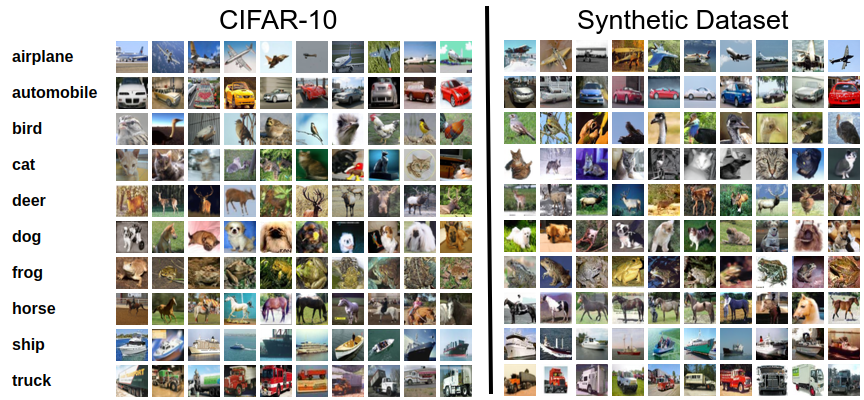

# One-step Diffusion with Distribution Matching Distillation
<a href="https://paperswithcode.com/paper/one-step-diffusion-with-distribution-matching"></a>


A PyTorch implementation of the paper [One-step Diffusion with Distribution Matching Distillation](https://arxiv.org/abs/2311.18828). This 
project codebase is mostly based on the codebase of [EDM from NVLabs](https://github.com/NVlabs/edm) and built on top of it with according 
modifications.

Note that this is an unofficial reimplementation study for the paper, and in this codebase we focused on experimenting 
with CIFAR-10 dataset reproduce the results. However, the technique may be applicable to other datasets with minor 
adjustments.

## Pretrained Models

You can access to the experimentation/training logs on [neptune](https://app.neptune.ai/o/metu-ms/org/DMD).

|                     | Model                                                                                                                                  |
|---------------------|----------------------------------------------------------------------------------------------------------------------------------------|
| CIFAR-10-32x32-cond | [https://huggingface.co/Devrim/dmd-cifar-10-cond](https://huggingface.co/Devrim/dmd-cifar-10-cond/resolve/main/model.pt?download=true) |


## Setup

Create a conda environment with the configuration file, and activate the environment when necessary.

```shell
conda env create -f environment.yml
```

You can access the CLI by, 

```shell
python -m dmd --help
```

### Models

DMD method is an application of distillation, and thus requires a teacher model. The teacher diffusion model 
used in the paper was [EDM models](https://github.com/NVlabs/edm). Specifically, for CIFAR-10 we will focus on 
a conditioned model. You can see pretrained EDM Models [here](https://nvlabs-fi-cdn.nvidia.com/edm/pretrained/).

### Dataset

Download the distillation dataset by,

```shell
bash scripts/download_data.sh
```

For reference, sample images from both CIFAR-10 datasets and from the base conditioned pretrained EDM model (CIFAR-10) are shown below:



## Training

Start training by running

```shell
python -m dmd train --model-path https://nvlabs-fi-cdn.nvidia.com/edm/pretrained/edm-cifar10-32x32-cond-vp.pkl --data-path /path/to/hdf5_data --output-dir /path/to/output-dir --epochs 2 --batch-size 32
```

To see all training arguments run

```shell
python -m dmd train --help
```

### Output Images

The `output_dir` used for saving checkpoints of the model, also used for saving images sampled from the model during training. The images saved are a grid of size `(5, batch_size)` where the rows correspond to `(x, x_real, x_pred, x_ref, y_ref)` respectively. We respect to the paper naming convention for these:

    z: Random sample from N(0,1).
    x: G(z). (row=1)
    s: edm_sigma(t) # t ~ U(0,1)
    noisy_x: forward_diffusion(x, s)  
    x_real: mu_real(noisy_x, t)  (row=2) # 'pred_real_image' in the paper
    x_fake: mu_fake(noisy_x, t)  (row=3) # 'pred_fake_image' in the paper
    z_ref: Paired latent from the synthetic dataset.
    x_ref: G(z_ref). (row=4)
    y_ref: Paired image sampled from the base pretrained model. (row=5)
    

### Logging to Neptune

Create a `neptune.cfg` file in the project root. The file content should look like this:

```ini
[credentials]
project=<project-name>
token=<replace-with-your-token>
```

Then, you can use `--log-neptune` flag to automatically log metrics to your neptune project.

## Generation
Once you trained the one-step generator. You can generate samples from it as follows:

```python
from dmd.generate import DMDGenerator
from dmd.utils.common import display_samples

gen = DMDGenerator(network_path="/path/to/model_checkpoint.pt")
samples = gen.generate_batch(seeds=list(range(25)), class_ids=0)
display_samples(samples).show()
```

## Assumptions

- Hyperparameters are explicitly stated, but there's no information for which model they are used. We assumed for both model when there is no additional information. (optimizer, lr)

## Development

For convenience add the project root to PYTHONPATH, earlier conda versions support this by `develop` command, run

```shell
conda develop /path/to/project_root
```

However, `conda develop` is deprecated for recent versions, you can manually add the project root to PYTHONPATH by

```shell
export PYTHONPATH="${PYTHONPATH}:/path/to/project_root"
```

### Code Formatting

To format the codebase, run

```shell
python -m scripts.run_code_style format
```

To check whether the codebase is well-formatted, run

```shell
python -m scripts.run_code_style check
```

## License

Copyright © 2022, NVIDIA CORPORATION & AFFILIATES. All rights reserved.\
Copyright © 2024, Devrim Cavusoglu & Ahmet Burak Yıldırım

This work contains the implementation of the methodology and study presented in the *One-step Diffusion with 
Distribution Matching Distillation* paper. Also as the building block of the codebase, [NVLabs/edm](https://github.com/NVlabs/edm) is 
used, modified and adapted accordingly when necessary. As the original license of the underlying framework (edm) 
dictates (ShareAlike), this derived work and all the source are licensed under the same license 
of [Attribution-NonCommercial-ShareAlike 4.0 International](https://creativecommons.org/licenses/by-nc-sa/4.0/deed.en).
