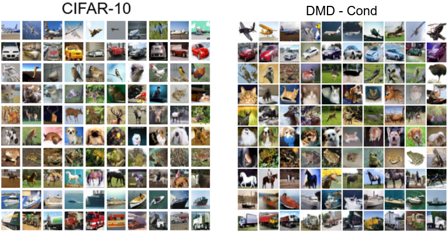

# [One-step Diffusion with Distribution Matching Distillation](https://arxiv.org/abs/2311.18828)

Tianwei Yin, Michaël Gharbi, Richard Zhang, Eli Shechtman, Fredo Durand, William T. Freeman, Taesung Park

*CVPR 2024*

This folder provides a re-implementation of this paper in PyTorch, developed as part of the course METU CENG 796 - Deep Generative Models. The re-implementation is provided by:
* Devrim Çavuşoğlu, devrim.cavusoglu@metu.edu.tr 
* Ahmet Burak Yıldırım, e270208@metu.edu.tr

Please see the jupyter notebook file [main.ipynb](main.ipynb) for a summary of paper, the implementation notes and our experimental results.

The project codebase here is a snapshot and refers to a specific commit in the maintained version of the codebase: [devrimcavusoglu/dm@project-v2](https://github.com/devrimcavusoglu/dmd). To see the up-to-date version of the DMD project, open issues or for questions refer to [devrimcavusoglu/dmd](https://github.com/devrimcavusoglu/dmd).

## License

Copyright © 2022, NVIDIA CORPORATION & AFFILIATES. All rights reserved.\
Copyright © 2024, Devrim Cavusoglu & Ahmet Burak Yıldırım

This work contains the implementation of the methodology and study presented in the *One-step Diffusion with 
Distribution Matching Distillation* paper. Also, as the building block of the codebase, [NVLabs/edm](https://github.com/NVlabs/edm) is 
used, modified and adapted accordingly when necessary. As the original license of the underlying framework (edm) 
dictates (ShareAlike), this derived work and all the source are licensed under the same license 
of [Attribution-NonCommercial-ShareAlike 4.0 International](https://creativecommons.org/licenses/by-nc-sa/4.0/deed.en).
